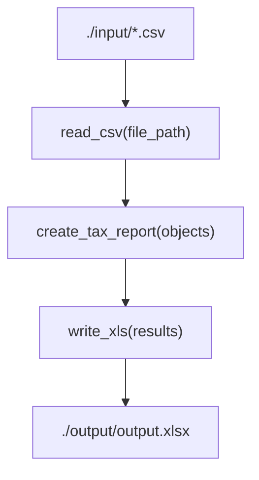

# coinmotion-transaction-helper

Tool for reading Coinmotion transactions, grouping them by currency, and generating an Excel output file. Coinmotion reports are now CSV, so the default flow uses the CSV reader.



## Usage

1. Export your Coinmotion report as `.csv`.
2. Place exactly one `.csv` file in `./input/`.
3. Run `main.py`.
4. The processed results will appear in `./output/` as one `.xlsx` and one `.pdf` per currency (each file includes a yearly summary and the full transaction list).

```powershell
python .\main.py
```

## Features

- Reads Coinmotion `.csv` transaction exports.
- Normalizes and groups transactions by currency.
- Generates a per-currency report structure and writes to Excel.

## Project Structure

- `readers/CsvReader.py`: CSV parsing for Coinmotion exports.
- `processor.py`: Builds the per-currency report structure used for output.
- `writers/XlsWriter.py`: Writes one output file per currency with a yearly summary and transactions.
- `writers/PdfWriter.py`: Writes one PDF report per currency.

## Dependencies

- Python 3.x
- [openpyxl](https://pypi.org/project/openpyxl/)
- [xlrd](https://pypi.org/project/xlrd/) (legacy `.xls` reader support)
- [reportlab](https://pypi.org/project/reportlab/) (PDF output)

## Installation

1. Install Python 3.x.
2. Clone or download this repository.
3. Navigate to the project directory and install dependencies:
   ```sh
   pip install -r requirements.txt
   ```

## Tests

Run the test suite with:

```powershell
python -m pytest
```
