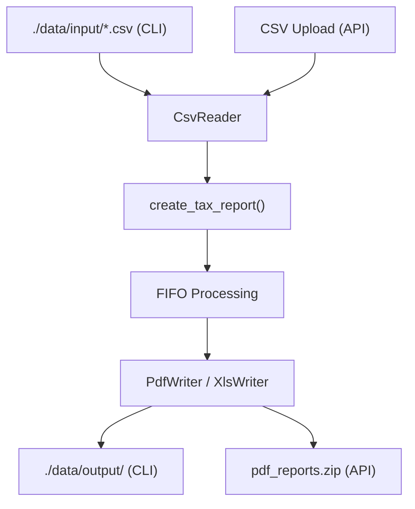

# coinmotion-transaction-helper

Tool for reading Coinmotion transactions, grouping them by currency, and generating an Excel output file. Coinmotion reports are now CSV, so the default flow uses the CSV reader.


```mermaid
flowchart TD
    A["./data/input/*.csv (CLI)"] --> B["CsvReader"]
    F["CSV Upload (API)"] --> B
    B --> C["create_tax_report()"]
    C --> G["FIFO Processing"]
    G --> D["PdfWriter / XlsWriter"]
    D --> E["./data/output/ (CLI)"]
    D --> H["pdf_reports.zip (API)"]
```

## Usage

### CLI Mode

1. Export your Coinmotion report as `.csv`.
2. Place exactly one `.csv` file in `./data/input/`.
3. Run `src/main.py` from the root directory.
4. The processed results will appear in `./data/output/` as one `.xlsx` per currency and a single `pdf_reports.zip` containing all PDF reports.

```powershell
python src\main.py
```

### Web UI (API Mode)

You can run the web application to upload files through a UI.

1. Start the API server from the root directory:
   ```powershell
   uvicorn src.api:app --reload
   ```
2. Start the Vite React development server:
   ```powershell
   cd frontend
   npm run dev
   ```
3. Open `http://localhost:5173` in your browser.

## Features

- Reads Coinmotion `.csv` transaction exports.
- Normalizes and groups transactions by currency.
- Generates a per-currency report structure and writes to Excel.

## Project Structure

- `src/readers/CsvReader.py`: CSV parsing for Coinmotion exports.
- `src/processor.py`: Builds the per-currency report structure used for output.
- `src/helpers/fifo.py`: Core logic for managing FIFO queue and assigning cost basis and hold rules.
- `src/writers/XlsWriter.py`: Writes one output file per currency with a yearly summary and transactions.
- `src/writers/PdfWriter.py`: Builds PDFs into a single zip archive.
- `src/api.py`: FastAPI application serving the REST API.
- `src/main.py`: Entrypoint for CLI operations.
- `frontend/`: React + Vite web application containing UI components and i18n configuration (`frontend/src/i18n.ts`).

## Dependencies

- Python 3.x
- [openpyxl](https://pypi.org/project/openpyxl/)
- [xlrd](https://pypi.org/project/xlrd/) (legacy `.xls` reader support)
- [reportlab](https://pypi.org/project/reportlab/) (PDF output)

## Installation

### Backend (Python)

1. Install Python 3.x.
2. Clone or download this repository.
3. Navigate to the project directory and create a virtual environment:
   ```sh
   python -m venv .venv
   .venv\Scripts\activate  # Windows
   # source .venv/bin/activate  # macOS/Linux
   ```
4. Install dependencies:
   ```sh
   pip install -r requirements.txt
   ```

### Frontend (React/Vite)

1. Navigate to the `frontend` directory:
   ```sh
   cd frontend
   ```
2. Install npm dependencies:
   ```sh
   npm install
   ```

## Tests

Run the test suite with:

```powershell
python -m pytest
```

## API

Start the API server:

```powershell
uvicorn api:app --reload
```

Upload a CSV file to receive `pdf_reports.zip`:

- `POST /report/pdf-zip` (multipart form-data with `file`)
